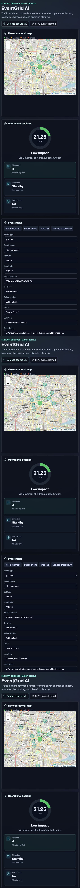

# EventGrid AI

EventGrid AI is an end-to-end prototype for Flipkart Gridlock Hackathon 2.0 Round 2, Topic 2: Event-Driven Congestion, Planned and Unplanned.

The system predicts event-driven operational traffic impact from the provided event operations dataset and recommends manpower, barricading, and diversion plans. It does not claim exact traffic speed or flow prediction because the dataset does not include speed, volume, or travel-time labels.

## Problem Statement

Political rallies, festivals, sports events, construction activity, road incidents, tree falls, water logging, VIP movement, and vehicle breakdowns create localized traffic breakdowns. Today, impact is often estimated manually, resource deployment is experience-driven, and there is limited post-event learning.

EventGrid AI turns historical event operations records into a decision-support layer:

1. Ingest an event report.
2. Predict road-closure risk.
3. Estimate high-priority likelihood and duration.
4. Score operational impact from 0 to 100.
5. Recommend manpower, barricading, response team, and diversion requirements.
6. Show hotspots and similar past events for operator context.

## Dataset Understanding

Input file:

- `data/events.csv`

Important columns used:

- Primary target: `requires_road_closure`
- Secondary target: `priority == High`
- Optional regression target: cleaned event duration from `end_datetime`, `closed_datetime`, or `resolved_datetime` minus `start_datetime`
- Core features: `event_type`, `event_cause`, `latitude`, `longitude`, `corridor`, `police_station`, `zone`, `junction`, `start_datetime`, `description`

The code drops leakage and post-outcome columns from model training, including status fields, closure/resolution timestamps, resolver IDs, vehicle number, KGID, client IDs, and similar post-event fields.

## ML Approach

Pipeline:

- Mixed-format datetime parsing with UTC to `Asia/Kolkata` conversion.
- `0.0` `endlatitude` and `endlongitude` values treated as missing.
- Time-based train/test split: earlier 80 percent for training, later 20 percent for validation.
- Historical closure rate features are fit only on the training slice before validation.
- CatBoost is used when available; sklearn RandomForest fallback is included.
- Class weighting is used for imbalanced road-closure prediction.

Engineered features:

- `hour_of_day`, `day_of_week`, `is_weekend`, `month`
- Categorical event fields
- Rounded latitude/longitude geospatial bin
- Historical closure rate by event cause, corridor, and police station
- Historical geospatial frequency
- Description length
- Keyword flags: accident, water, heavy, blocked, breakdown, tree, VIP, procession, construction

## Impact Score

`impact_score` is a 0 to 100 operational score:

```text
45% road_closure_probability
25% high_priority_probability
20% historical_hotspot_score
10% expected_duration_score
```

Risk levels:

- `0-30`: Low
- `31-60`: Medium
- `61-80`: High
- `81-100`: Critical

## Recommendation Engine

The rule layer sits on top of model outputs:

- VIP movement, procession, or public event with high score: high manpower, barricading, route diversion.
- Tree fall, water logging, accident, potholes, debris, or road condition issue: emergency clearance team, temporary control, police support.
- Vehicle breakdown: tow vehicle and quick response team.
- Long construction event: planned barricading, public notification, diversion readiness.

API output includes:

- `recommended_manpower`
- `barricading_required`
- `diversion_required`
- `response_team_type`
- explanation factors
- weighted impact score components
- similar-event evidence summary
- deployment timeline
- exportable incident report payload

## Current Model Metrics

Generated at: `reports/metrics.json`

Road-closure model on the time-based holdout:

- ROC-AUC: `0.823`
- PR-AUC / Average Precision: `0.379`
- Precision: `0.274`
- Recall: `0.655`
- F1: `0.386`
- Top 10 percent risk capture: `0.479`

Duration model:

- MAE: `9.06` hours

The high-priority model is included only as a secondary operational signal. Its validation score is very high on this split, so it should not be used as the sole proof of system quality.

## Project Structure

```text
data/
  events.csv
notebooks/
src/
  api/main.py
  data_processing.py
  evaluation.py
  features.py
  predict.py
  recommend.py
  train.py
frontend/
  React + Leaflet dashboard
models/
  eventgrid_model_bundle.joblib
reports/
  metrics.json
  eda_summary.md
tests/
  test_core.py
```

## Run Backend

```bash
python3 -m venv .venv
source .venv/bin/activate
pip install -r requirements.txt
python3 -m src.train
uvicorn src.api.main:app --reload --host 0.0.0.0 --port 8000
```

Health check:

```bash
curl http://localhost:8000/health
```

Prediction example:

```bash
curl -X POST http://localhost:8000/predict-impact \
  -H "Content-Type: application/json" \
  -d '{
    "event_type": "unplanned",
    "event_cause": "tree_fall",
    "latitude": 13.0061,
    "longitude": 77.5794,
    "start_datetime": "2024-04-08T08:15:00+05:30",
    "corridor": "Non-corridor",
    "police_station": "Sadashivanagar",
    "zone": "Central Zone",
    "junction": "BashyamCircle",
    "description": "Tree fall blocking one lane after heavy rain"
  }'
```

## Run Frontend

The fixed Vite version requires Node `20.19+` or `22.12+`. In this Codex workspace, the bundled Node runtime is compatible:

```bash
cd frontend
npm install
npm run dev
```

Open:

- `http://localhost:5173`

If using the bundled Codex runtime locally:

```bash
PATH="/Users/satyamkumar/.cache/codex-runtimes/codex-primary-runtime/dependencies/node/bin:$PATH" npm run dev
```

## API Endpoints

- `GET /health`
- `POST /predict-impact`
- `GET /hotspots`
- `GET /similar-events`
- `GET /model-metrics`
- `POST /recommend-plan`

## Demo Scenarios

The dashboard includes prefilled scenarios:

- VIP movement
- Public event
- Tree fall
- Vehicle breakdown

Each scenario should produce different operational recommendations.

## Dashboard Screenshots

Command-center smoke-test screenshot:



Add final submission screenshots here after the demo styling freeze:

- Event input and prediction cards
- Risk map with event marker and hotspots
- Similar events and recommendation panel
- Model metrics panel

## Tests

```bash
pytest -q
cd frontend
PATH="/Users/satyamkumar/.cache/codex-runtimes/codex-primary-runtime/dependencies/node/bin:$PATH" npm run build
```

Current local verification:

- `pytest -q`: 5 passed
- `npm run build`: passed under bundled Node 24.14.0
- `npm audit --omit=dev`: 0 vulnerabilities under the fixed Vite line

## Limitations

- No exact traffic speed, volume, or travel-time prediction because those labels are not present.
- Historical closure rates are derived from the event operations dataset, not from live sensors.
- Duration labels depend on available closure/resolution timestamps and contain operational noise.
- Recommendations are rule-based and should be reviewed by traffic operators before deployment.
- Hotspots are rounded-coordinate and grouped historical patterns, not H3 production indexing.

## Future Improvements

- Integrate live traffic speed, camera, weather, and event calendar feeds.
- Replace rounded geobins with H3.
- Calibrate model probabilities and tune thresholds by operational cost.
- Add SHAP explanations for individual predictions.
- Add route graph integration for diversion suggestions.
- Add operator feedback loops to improve post-event learning.
